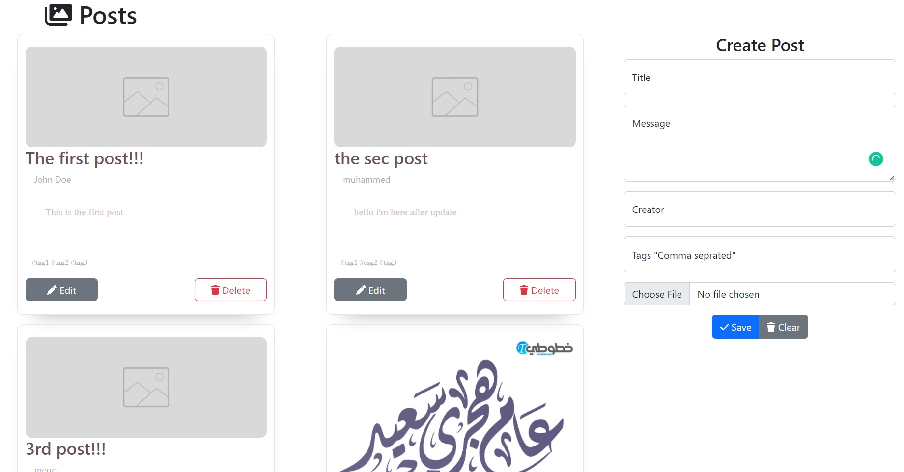
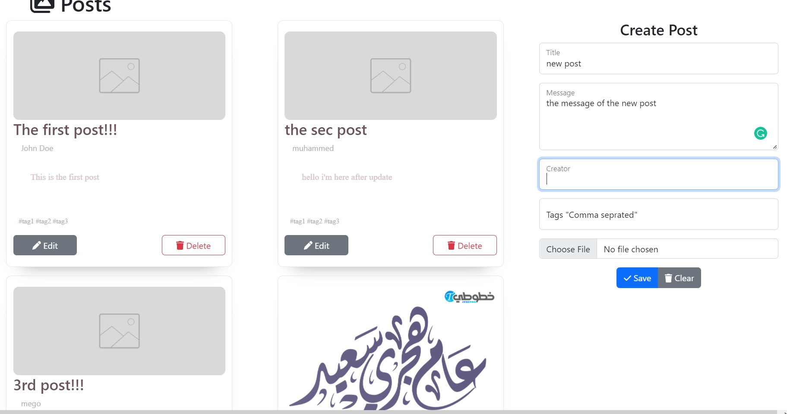
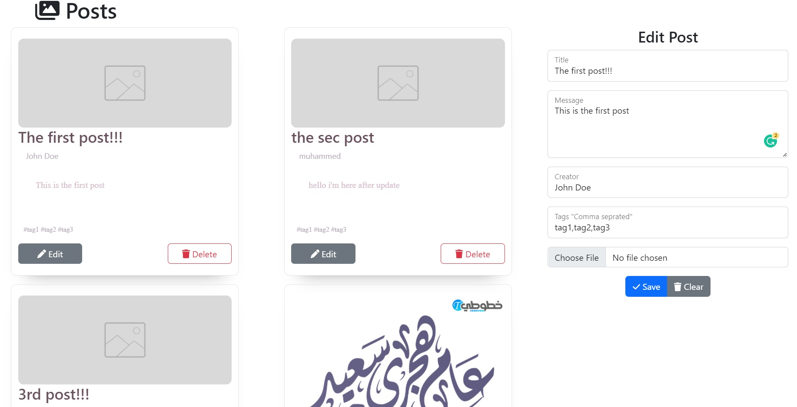

# Posts application using MERN

an application that use monogodb with atlas, express for the back-end, react with redux@toolkit for the front-end and node.js

an application that use the CRUD (create, read, update, delete) operations to save, update, delete your posts.

## app screenshot

## create post screenshot

## edit post screenshot

